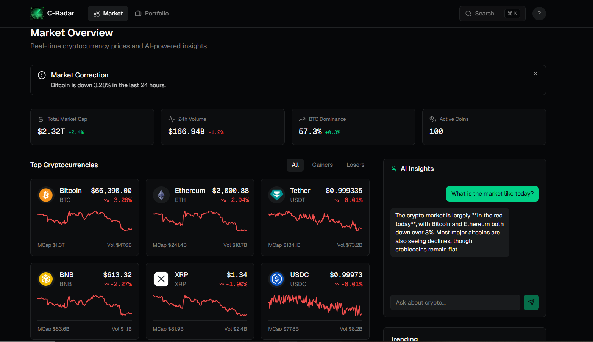

# C-Radar (Crypto Intelligence)



C-Radar is a full-stack, blazing-fast cryptocurrency tracking dashboard built to keep you constantly updated with the market momentum. The application seamlessly integrates the **CoinGecko API** for real-time market data alongside **Google Gemini AI** to provide an intelligent, live-context chat assistant—and does it all securely through a robust stateless Rust backend proxy.

## Tech Stack
* **Frontend:** Next.js (App Router), React, Tailwind CSS, Lucide React Mapped Icons.
* **Backend Proxy:** Rust, Tokio, Axum, reqwest.

---

## How It Works

This application utilizes a decoupled proxy approach to strongly protect API keys:
1. **The Browser:** The Next.js React client runs statically, strictly making basic API calls to the Rust proxy (`http://127.0.0.1:8080`). It houses no database or session logic, saving lightweight user-preferences to `localStorage` or pure uncommitted state.
2. **The Rust Backend Proxy:** The Rust `/backend` is fully stateless. When it receives a request to `/market` or `/insight`, it utilizes `reqwest` to independently query the CoinGecko API or Google Gemini models securely behind closed doors using locally stored secret keys. 
3. **Live AI Triggers:** Because the Gemini API inherently lacks current market context, asking our chatbot "What's the market like?" triggers a real-time fetch to CoinGecko inside the Rust backend first, formatting the top 10 current circulating tokens accurately into the Gemini prompt dynamically before sending your question over. This allows your AI to answer as a globally informed trading assistant!

## Setup Instructions

### 1. Configure Environment Variables
You'll need two separate `.env` files (one for the frontend Node system, one for the backend Rust system). Example files are provided.

First, set up your Next.js file in the root directory:
```bash
cp .env.local.example .env.local
```

Next, set up the backend Rust variables:
```bash
cd backend
cp .env.example .env
```
Inside `backend/.env`, you must insert your valid CoinGecko and Gemini API Keys!

### 2. Start the Backend Proxy (Port 8080)
```bash
cd backend
cargo run
```

### 3. Start the Next.js Frontend (Port 3000)
Open a new terminal at the root directory of the application:
```bash
npm install
npm run dev
```

The application is now up and humming smoothly. Visit `http://localhost:3000` to dive into the market!
